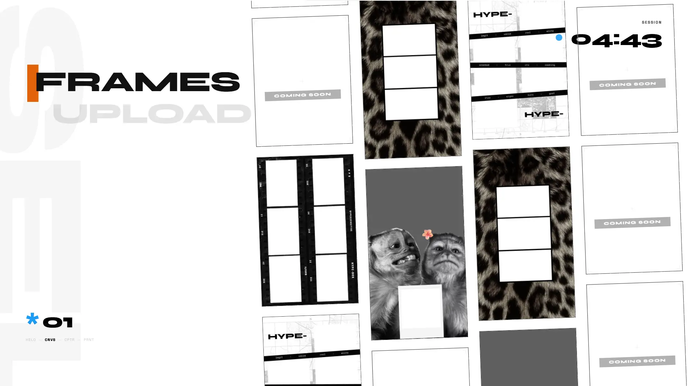

# HYPE-BOX Demo

A self-contained photobooth experience demo built to showcase the core experience behind **HYPE-BOX**: a modern digital photobooth platform.

Live Demo
[Open the interactive demo →](https://navoyovan.github.io/photobooth-kiosk-demo/)

> This demo runs entirely in the browser and does not connect to
the production HYPE-BOX backend or payment infrastructure.

Capture photos, apply layouts, generate photostrips, and share the result through QR download.

HYPE-BOX is a photobooth platform designed for events and businesses, combining interactive experiences with kiosk hardware, cloud services, and management tools.

This is an interactive frontend demonstration of the HYPE-BOX kiosk experience. It is not the production kiosk software.

> This repository contains the demo experience only. Production features such as printing, payment integration, vendor management, kiosk fleet control, and analytics are part of the commercial platform.

## Scope

Included:

- Photobooth interface
- Capture experience
- Photo composition pipeline
- Digital delivery workflow

Not included:

- Physical printing
- Vendor dashboard
- Kiosk management
- Remote monitoring
- Production hardware integration

## Technology

Built as a demonstration of interactive kiosk experiences, combining frontend interaction, image processing, and digital content delivery.

## Screenshots

## License

This project is available under the HYPE-BOX Demo License.
See [LICENSE.md](LICENSE.md)
